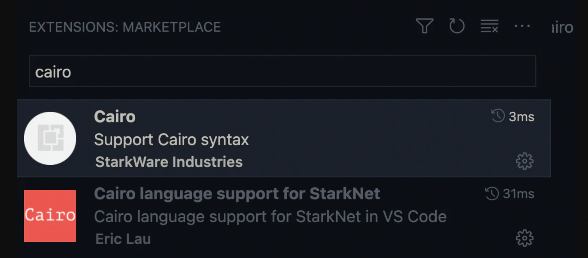

# **Programming on Ethereum's L2: Cairo Basics pt. one**

🚀 The future of Ethereum is today and it's already here. Let's learn how to use an ecosystem that:

- It supports dYdX, DeFi that has already made four hundred billion trades and represents about a quarter of all transactions made in ethereum. They have only been around for 18 months and consistently beat Coinbase in trade volume. They reduced the price of transactions from 500 to 1,000 times. They are so cheap that they don't need to charge users for gas 💸.
- From the week of March 7 to 13, 2022, for the first time, it managed to have 33% more transactions than Ethereum 💣.

And it's just the beginning. Learn a little more about the Starkware ecosystem in [this short text](https://mirror.xyz/espejel.eth/PlDDEHJpp3Y0UhWVvGAnkk4JsBbJ8jr1oopGZFaRilI). Join the largest Spanish-speaking [Meetup](https://www.meetup.com/fr-FR/starknet_latam/) on StarkNet. Say hi on the #🌮-Spanish channel on the StarkNet [Discord](https://discord.gg/uJ9HZTUk2Y). 

We are going to learn how to install Cairo on our machines and get everything ready to start programming ❤️. We will also learn basic commands to interact with Cairo from our terminal.

[The Cairo documentation](https://www.cairo-lang.org/docs/quickstart.html) gives us very clear instructions. However, there may be exceptions depending on your machine.

## **1. Installing Cairo**

The Cairo [documentation](https://www.cairo-lang.org/docs/quickstart.html#installation) says:

> We recommend working inside a virtual python environment, but you can also install the Cairo package directly. To create and enter the virtual environment, type: 

```bash
python3.7 -m venv ~/cairo_venv
source ~/cairo_venv/bin/activate
```

Make sure `venv` is enabled; you should see (`cairo_venv`) on the command line.

Make sure you can install the following pip packages: `ecdsa`, `fastecdsa`, `sympy` (using `pip3 install ecdsa fastecdsa sympy`). On Ubuntu, for example, you'll first need to run: `sudo apt install -y libgmp3-dev.`

On Mac, you can use brew: `brew install gmp`.

Install the `cairo-lang` python package using `pip3 install cairo-lang`.

If all went well with these instructions, great 🥳. It is very likely that this was not the case. I installed Cairo on Ubuntu and MacOS and neither installation came out right away 🙉. Don't worry. It is resolved.

### ****1.1. MacOS****

If you are using MacOS you will probably have problems installing `gmp` with `brew install gmp`

[This answer](https://github.com/OpenZeppelin/nile/issues/22) to an issue in the Nile repository has four different ways to fix it:

I used `CFLAGS=-Ibrew --prefix gmp/include LDFLAGS=-Lbrew --prefix gmp/lib pip install ecdsa fastecdsa sympy` on my terminal and it worked like a charm.

Another very interesting article recommends installing using Docker:

```docker
# install build tools
xcode-select --install

# install brew
/bin/bash -c "$(curl -fsSL https://raw.githubusercontent.com/Homebrew/install/HEAD/install.sh)"

# install python3.7
brew install python@3.7 git gmp

# install cairo
python3.7 -m venv ~/cairo_venv
source ~/cairo_venv/bin/activate
pip3 install ecdsa fastecdsa sympy cairo-lang

# install docker: https://docs.docker.com/desktop/mac/install
# pull containers
docker pull shardlabs/starknet-devnet
docker pull trufflesuite/ganache-cli
docker pull eqlabs/pathfinder

# start ganache
# to see the ganache logs: docker logs -f $(docker ps | grep ganache-cli | awk '{print $1}')
docker run -d --rm --network host trufflesuite/ganache-cli

# start starknet-devnet
# to tail ganache logs: docker logs -f $(docker ps | grep starknet-devnet | awk '{print $1}')
docker run -d --rm --network host shardlabs/starknet-devnet

# pathfinder
# to see the pathfinder logs: docker logs -f $(docker ps | grep pathfinder | awk '{print $1}')
git clone https://github.com/eqlabs/pathfinder.git
cd pathfinder; docker build -t pathfinder .
docker run -d --rm --network host -e RUST_LOG=info -e ETH_RPC_URL=https://mainnet.infura.io/v3/<INFURA_ID> pathfinder

# cairo shortcuts
# NOTE: it is assumed that you use zsh
mkdir -p $HOME/cairo_libs
git clone git@github.com:OpenZeppelin/cairo-contracts.git $HOME/cairo_libs
ln -s $HOME/cairo_libs/cairo-contracts/src/openzeppelin $HOME/cairo_libs/openzeppelin
echo 'alias cairodev="python3.7 -m venv ~/cairo_venv; source ~/cairo_venv/bin/activate; export STARKNET_NETWORK=alpha-goerli; export CAIRO_PATH=~/cairo_libs; export STARKNET_WALLET=starkware.starknet.wallets.open_zeppelin.OpenZeppelinAccount"' >> ~/.zshrc
echo 'alias cairoprod="python3.7 -m venv ~/cairo_venv; source ~/cairo_venv/bin/activate; export STARKNET_NETWORK=alpha-mainnet; export CAIRO_PATH=~/cairo_libs; export STARKNET_WALLET=starkware.starknet.wallets.open_zeppelin.OpenZeppelinAccount"' >> ~/.zshrc
source ~/.zshrc
```

### ****1.2. Ubuntu****

The same article recommends the following installation for Ubuntu:

```docker
# system setup
sudo apt update && sudo apt upgrade
sudo apt install -y software-properties-common git curl pkg-config build-essential libssl-dev libffi-dev libgmp3-dev

# install python3.7
sudo add-apt-repository ppa:deadsnakes/ppa -y
sudo apt install -y python3.7 python3.7-dev python3.7-venv python3-pip

# install cairo
python3.7 -m venv ~/cairo_venv
source ~/cairo_venv/bin/activate
pip3 install ecdsa fastecdsa sympy cairo-lang

# cairo shortcuts
mkdir -p $HOME/cairo_libs
git clone git@github.com:OpenZeppelin/cairo-contracts.git $HOME/cairo_libs
ln -s $HOME/cairo_libs/cairo-contracts/src/openzeppelin $HOME/cairo_libs/openzeppelin
echo 'alias cairodev="python3.7 -m venv ~/cairo_venv; source ~/cairo_venv/bin/activate; export STARKNET_NETWORK=alpha-goerli; export CAIRO_PATH=~/cairo_libs; export STARKNET_WALLET=starkware.starknet.wallets.open_zeppelin.OpenZeppelinAccount"' >> ~/.bashrc
echo 'alias cairoprod="python3.7 -m venv ~/cairo_venv; source ~/cairo_venv/bin/activate; export STARKNET_NETWORK=alpha-mainnet; export CAIRO_PATH=~/cairo_libs; export STARKNET_WALLET=starkware.starknet.wallets.open_zeppelin.OpenZeppelinAccount"' >> ~/.bashrc
source ~/.bashrc
```

### 1.3. Windows
🧐 … 🧐


## **2. VSCode for your Cairo 𓀀**

If you write cairo in the VSCode plugin search engine (here tutorial on how to install plugins) only two will appear. We are starting 🚀:



Packages to program with Cairo in VSCode.

Both extensions are useful.

1. The first, Cairo, was created by StarkWare.
2. The second, Cairo language support for StarkNet, was created by Eric Lau who is part of Open Zepellin.

I recommend installing both in your VSCode.

Now you will see that your code in Cairo looks much better, is easier to read and returns errors in real time. You don't have to wait to compile your code to see if it has errors 🥳.


## 3. Compile and run your Cairo code 𓀀

The tools that StarkNet offers to interact with the command line are many 🙉. We won't go into detail until later. For now, we will only show the commands with which we can run the application that we will make in the next tutorial 🧘‍♀️. But don't worry, the commands to run other applications will be very similar.

`cairo-compile` allows us to compile our code and export a json that we will read in the next command. If we have a program called `array_sum.cairo`  and we want the json to be called `x.json` then we would use the following code:

```cairo
cairo-compile array_sum.cairo --output x.json
```

Simple, right? ❤️

Ok now let's run our code with `cairo-run`.

```bash
cairo-run --program=x.json
    --print_output --layout=small
```

Here the details:

- We indicate in the `--program argument` that we want to run the `x.json` that we generated earlier.
- With `--print_output` we indicate that we want to print something from our program to the terminal. For example, in the next tutorial we will use the builtin (we will study them later) `output` and the `serialize_word` function to print to the terminal.
- `--layout allows` us to indicate the layout to use. Depending on the builtins we use, it will be the layout to use. Later we will be using the `output` builtin and for this we need the `small` layout. Below is a photo of the builtins that the `small` layout covers. If we will not use any builtin then we can leave this argument empty so we would use the default layout, the `plain`.


Builtins covered by the small layout.

## ****What is next?…****

In the next tutorial we will learn the basics of Cairo 🥳. We will use everything learned and prepared here. We're going to have even more fun.

In the following tutorials we will learn more about pointers and memory management; the cairo common library; how the Cairo compiler works; and more!

Any comments or improvements please make a PR or comment with [@espejelomar](https://twitter.com/espejelomar) 🌈.
