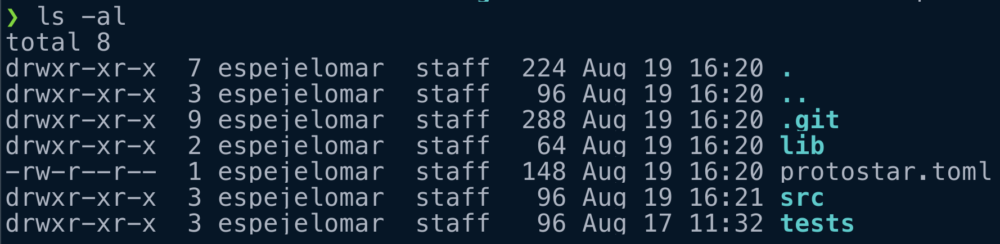
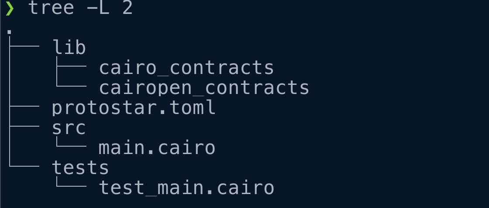
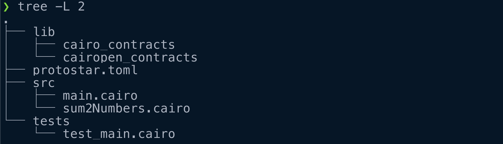
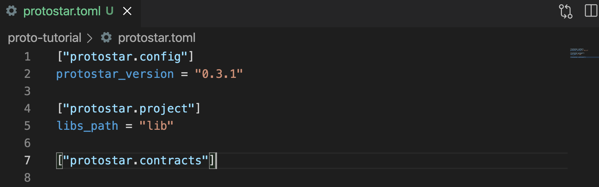
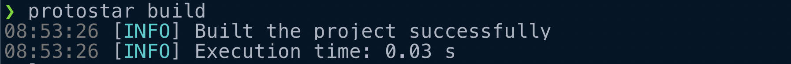
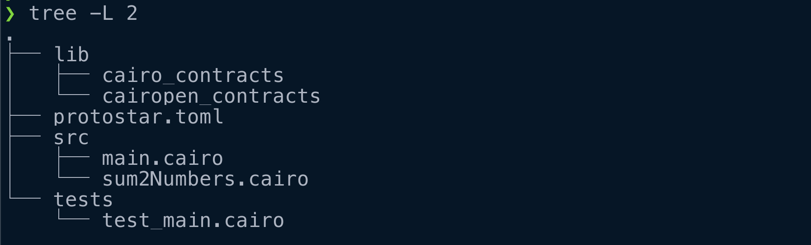
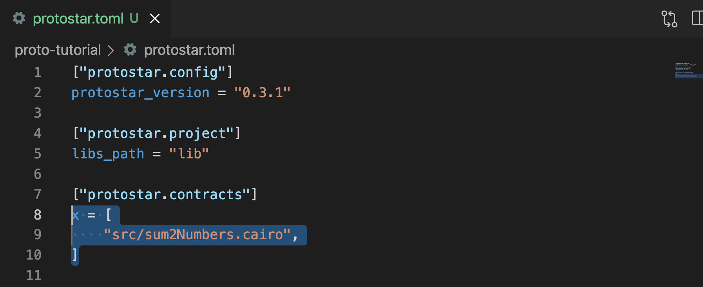
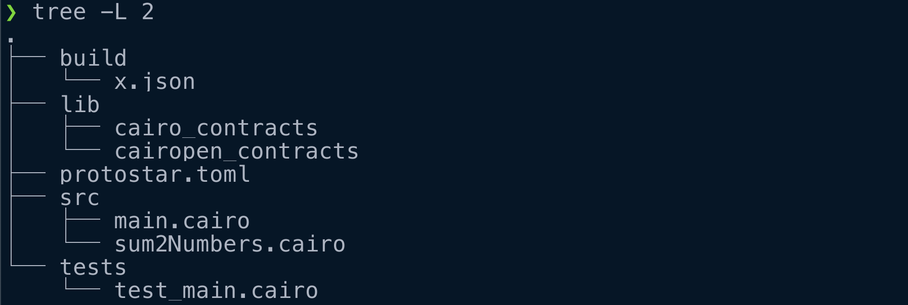
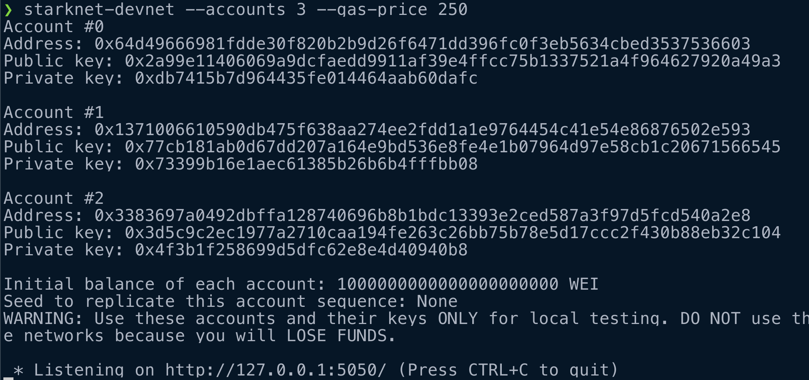
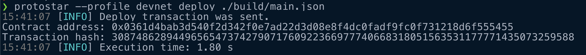

# Programando en la L2 de Ethereum (pt. 4): Protostar y desplegando contratos (WIP)

Antes de comenzar, te recomiendo que prepares tu equipo para programar en Cairo ❤️ con el [primer tutorial](tutorial_1.md), y revises los [básicos de Cairo pt. 1](tutorial_2.md) y [pt. 2](tutorial_3.md).

Únete a la comunidad de habla hispana de StarkNet ([Linktree](https://linktr.ee/starknet_es) con links a telegram, tutoriales, proyectos, etc.). Este es el cuarto tutorial en una serie enfocada en el desarrollo de smart cotracts con Cairo y StarkNet. Recomiendo que hagas los tutoriales pasados antes de pasar a este.

🚀 El futuro de Ethereum es hoy y ya está aquí. Y apenas es el comienzo. Aprende un poco más sobre el ecosistema de Starkware en [este texto corto](https://mirror.xyz/espejel.eth/PlDDEHJpp3Y0UhWVvGAnkk4JsBbJ8jr1oopGZFaRilI).

---

> “StarkNet es un ZK-Rollup descentralizado sin permiso que funciona como una red L2 sobre Ethereum, donde cualquier dApp puede escalar ilimitadamente para su cálculo, sin comprometer la compatibilidad y la seguridad de Ethereum.” - [Documentación de StarkNet](https://starknet.io/docs/hello_starknet/index.html#hello-starknet).

¡Felicidades! 🚀 Ya tenemos un nivel intermedio de Cairo. Cairo es para StarkNet lo que Solidity es para Ethereum. Es hora de desplegar nuestros contratos en StarkNet. También aprenderemos a utilizar [Protostar](https://github.com/software-mansion/protostar), herramienta inspirada en [Foundry](https://github.com/foundry-rs/foundry) y clave para compilar, hacer tests y desplegar.

Actualmente podemos operar con el Alpha de StarkNet. Los pasos recomendados para el despliegue de contratos es:

1. Unit tests - Protostar.
2. Devnet - [Shard Lab’s](https://github.com/Shard-Labs/starknet-devnet) `starknet-devnet` (revisado aquí).
3. Testnet - Alpha Goerli, `alpha-goerli` (revisado aquí).
4. Mainnet - Alpha StarkNet, `alpha-mainnnet`.

En este tutorial aprenderemos a usar la devnet y la testnet. En un texto siguiente aprenderemos a crear unit tests con Protostar.

¡Comencemos!

---

## 1. Instalación de Protostar

En este punto ya tenemos instalado `cairo-lang`. Si no, puedes revisar [nuestro tutorial](https://medium.com/starknet-en-espa%C3%B1ol/programando-en-la-l2-de-ethereum-b%C3%A1sicos-de-cairo-pt-1-8cc6c94571f1) sobre cómo instalarlo.

En Ubuntu o MacOS (no está disponible para Windows) corre el siguiente comando:

`curl -L https://raw.githubusercontent.com/software-mansion/protostar/master/install.sh | bash`

Reinicia tu terminal y corre `protostar -v` para ver la versión de tu `protostar` y `cairo-lang`.

Si más adelante quieres actualizar tu protostar usa `protostar upgrade`. Si te encuentras con problemas en las instalación te recomiendo que revises la [documentación de Protostar](https://docs.swmansion.com/protostar/docs/tutorials/installation).

## 2. Primeros pasos con Protostar

¿Qué significa inicializar un proyecto con Protostar?

- **Git**. Se creará un nuevo directorio (carpeta) que será un repositorio de git (tendrá un archivo `.git`).
- `protostar.toml`. Aquí tendremos información necesaria para configurar nuestro proyecto. ¿Conoces Python? Bueno ya sabes por donde vamos con esto.
- **Se crearán tres directorios src** (donde estará tu código), lib (para dependencias externas), y tests (donde estarán los tests).

Puedes inicializar tu proyecto con el comando  `protostar init`, o puedes indicar que un proyecto existente utilizará Protostar con `protostar init --existing`. Básicamente, solo necesitas que tu directorio sea un repositorio de git y tenga un archivo `protostar.toml` con la configuración del proyecto. Incluso, podríamos crear nosotr@s mism@s el archivo `protostar.toml` desde nuestro editor de texto.

Corramos `protostar init` para inicializar un proyecto de Protostar:

<p align="center">
    <br>
    
    <br>
<p>

Nos pide indicar dos cosas:

- `project directory name`: ¿Cuál es el nombre del directorio donde se encuentra tu proyecto?
- `libraries directory name`: ¿Cuál es el nombre del directorio donde se instalarán dependencias externas?

Así luce la estructura de nuestro proyecto:

<p align="center">
    <br>
    
    <br>
<p>

- Inicialmente, aquí se encuentra información sobre la versión de protostar utilizada `[“protostar.config“]`, dónde se encontrarán las librerías externas utilizadas

## 3. Instalando dependencias (bibliotecas) externas

Protostar utiliza submodules de git para instalar dependencias externas. Próximamente se hará con un package manager. Instalemos un par de dependencias.

Instalando `cairo-contracts` indicamos el repositorio donde se encuentran, es decir, [github.com/OpenZeppelin/cairo-contracts](http://github.com/OpenZeppelin/cairo-contracts). Usemos `protostar install`:

`protostar install https://github.com/OpenZeppelin/cairo-contracts`

Instalemos una dependencia más, `cairopen_contracts`:

`protostar install https://github.com/CairOpen/cairopen-contracts`

Nuestras nuevas dependencias se almacenan el directorio `lib`:

<p align="center">
    <br>
    
    <br>
<p>

¡Maravilloso!

## 4. Compilando

En el pasado hemos estado compilando nuestros contratos con `cairo-compile`. Cuando corremos `cairo-compile sum2Numbers.cairo --output x.json` para compilar un contrato `sum2Numbers.cairo` de Cairo, el resultado es un nuevo archivo en nuestro directorio de trabajo llamado `x.json`. El archivo json es utilizado por `cairo-run` cuando corremos nuestro programa.

En Protostar podemos compilar todos nuestros contratos a la vez con `protostar build`. Pero antes debemos indicar en la sección `[“protostar.contracts”]` de `protostar.toml` los contratos que queremos compilar (o build). Volviendo al ejemplo anterior, imagina que tenemos un contrato `sum2Numbers.cairo` en nuestra carpeta `src` (donde están los contratos):

<p align="center">
    <br>
    
    <br>
<p>

Veamos qué pasa si dejamos la sección [“protostar.contracts”] vacía en protostar.toml (como en el screenshot de abajo) y corremos protostar build en la terminal.

<p align="center">
    <br>
    
    <br>
<p>

La compilación fue exitosa:

<p align="center">
    <br>
    
    <br>
<p>

Pero es porque no se compiló nada. Si hubieramos compilado algo tendríamos un nuevo directorio llamado build en nuestro proyecto, pero no:

<p align="center">
    <br>
    
    <br>
<p>

Compilemos algo de verdad. Primero colocamos en `protostar.toml` que queremos compilar el contrato en `src/sum2Numbers.cairo` y que lo queremos llamar `x`, tal como hicimos antes con `cairo-compile sum2Numbers.cairo --output x.json`:

<p align="center">
    <br>
    
    <br>
<p>

Corremos de nuevo `protostar-build`. Veremos que tenemos un nuevo directorio `build` con un archivo `x.json`. ¡Esto es lo que buscábamos!

<p align="center">
    <br>
    
    <br>
<p>

Moraleja: si tu contrato no está en la sección `[“protostar.contracts“]` del `protostar.toml` no será compilado.

En este punto podemos pasar a desplegar contratos de StarkNet con Protostar.

## 5. La devnet: starknet-devnet

Las transacciones en la testnet toman tiempo para completarse por lo que es mejor comenzar desarrollando y probando localmente. Utilizaremos la [devnet desarollada por Shard Labs](https://github.com/Shard-Labs/starknet-devnet). Podemos pensar en este paso como un equivalente de Ganache. Es decir, emula la testnet (alpha goerli) de StarkNet.

Instala usando:

`pip install starknet-devnet`

Reinicia tu terminal y corre `starknet-devnet --version` para revisar que la instalación fue correcta. Revisa que tengas [la versión más actualizada](https://github.com/Shard-Labs/starknet-devnet/releases). Si no la tienes entonces corre `pip install --upgrade starknet-devnet`.

Inicializa la devnet en una shell separada (o una pestaña) con `starknet-devnet --accounts 3 --gas-price 250 --seed 0`:

<p align="center">
    <br>
    
    <br>
<p>

Con esto estamos indicando que crearemos tres cuentas y que las transacciones costarán 250 wei per gas. Colocamos un número en seed para tener las mismas cuentas cada vez que activemos nuestra devnet. Estas cuentas están basadas en el código y estándares desarrollados por [Open Zepellin para Cairo](https://github.com/OpenZeppelin/cairo-contracts/tree/v0.2.1).

Es clave que tengamos a la mano la dirección en donde está corriendo nuestra devnet. En la foto arriba es: `http://127.0.0.1:5050/`. Más adelante la utilizaremos.

La interacción con la devnet y la testnet es muy similar. Si quieres ver todos los argumentos disponibles en la llamada `starknet-devnet` puedes llamar `starknet-devnet --help`.

Utilicemos un ejemplo real. Cuando inicializamos un proyecto de Protostar, se crea automáticamente un contrato `main.cairo` en el directorio `src`. Podemos usarlo como ejemplo de un contrato para desplegar en la devnet y después en la testnet. Solo necesitas asegurarte de que en `protostar.toml` definamos que será compilado (foto abajo). Corre `protostar build` para crear el `build/main.json` que usaremos para el despliegue.

Para hacer deploy de nuestros contratos en la devnet desde Protostar podemos crear configuration profiles. En el `protostar.toml` creamos una sección `[profile.devnet.protostar.deploy]` donde colocamos el url donde desplegamos nuestra devnet localmente: `gateway-url=”http://127.0.0.1:5050/”`:

```
["protostar.config"]
protostar_version = "0.3.2"

["protostar.project"]
libs_path = "lib"

["protostar.contracts"]
main = [
    "src/main.cairo",
]

[profile.devnet.protostar.deploy]
gateway-url="http://127.0.0.1:5050/"
```

Ahora corremos `protostar --profile devnet deploy ./build/main.json` para hacer el despliegue en la devnet:

<p align="center">
    <br>
    
    <br>
<p>

Nota que colocar el gateway-url de la devnet en el protostar.toml nos ayuda a simiplicar nuestra llamada. Sin embargo, habríamos tenido el mismo resultado con `protostar deploy ./build/main.json --gateway-url "http://127.0.0.1:5050/"`.

Nota que nos retorna el contract address y el transaction hash. Todo fue inmediato, esa es la ventaja de desplegar primero en la devnet.

Desplegar en la testnet con prostar es muy simple, veamos.

## 6. La testnet: alpha-goerli

Para desple

## 7. Conclusión

Felicidades 🦾. ¡Acabas de dar tus primeros pasos en StarkNet! Estás aprovechando todo lo aprendido en los tutoriales pasados sobre Cairo.

En los siguientes tutoriales aprenderemos más sobre la creación de smart contracts en StarkNet 🚀.

Cualquier comentario o mejora por favor comentar con [@espejelomar](https://twitter.com/espejelomar) 🌈.